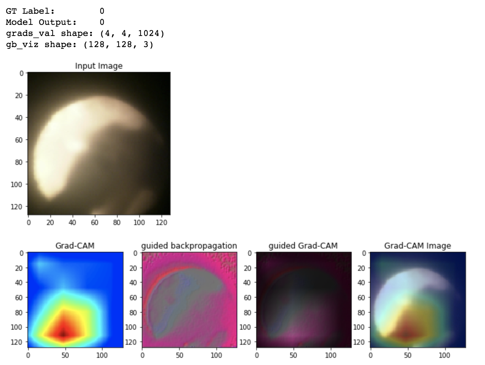

# Classification of Blast Furnace Status
This project aims to classify the status of blast furnace into 5 categories  
(0: normal, 1: Non-blowing of pulverized coal, 2: Poor combustion, 3: Iron-ore falling, 4: Coke Turning)  

The classification model showed **above 90% accuracy**.   

For introducing the model on industrial floor,  
Grad-cam is applied in order to explain reasoning area of blast furnace images.

The result example is below.  

The data and trained model can't be open for security reasons.  
However, I opened used source code of simple classification model and grad-cam.

